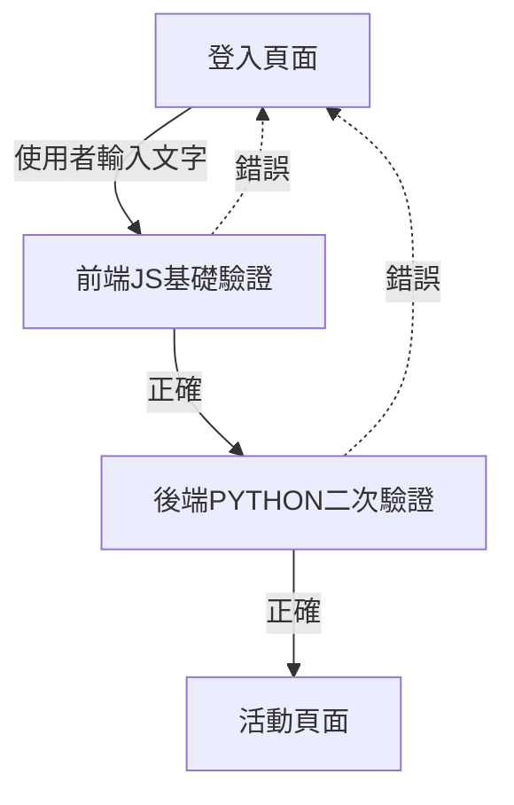

#### Interactive question answering app 開發紀錄

**參考文件**
網頁
[Flask Tutorial](https://www.geeksforgeeks.org/flask-tutorial/)

Youtube
[CS50x 2024 - Lecture 9 - Flask](https://www.youtube.com/watch?v=-aqUek49iL8)

[Python + JavaScript - Full Stack App Tutorial](https://www.youtube.com/watch?v=PppslXOR7TA)

---

**流程圖**

